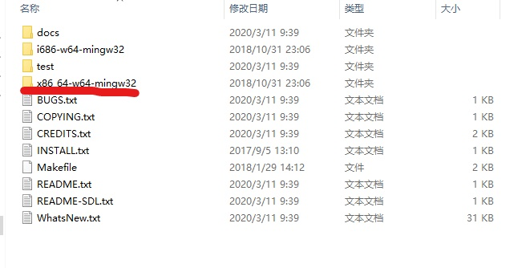
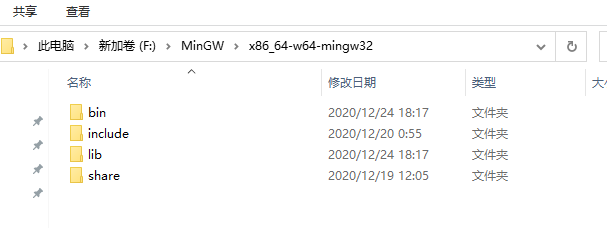

# 介绍  

​	记录了自己是怎么配置SDL第三方库，其中遇到的问题和解决方法 

<!-- more -->  

# 配置SDL第三方库

## 环境

- VScode
- windows
- MinGW64

## 下载SDL

 

​		根据自己的编译器选择。

​         下载完成后根据自己使用的是64位还是32位MinGW选择文件夹复制粘贴到MinGW文件夹中里面。我是64位MinGW。所以在这里我选择x86的文件夹并复制粘贴。

## 配置VScode

​        要在c_cpp_properties.json中输入路径。  

​        要在task.json文件中链接静态库。“lmingw32”、"-lSDL2main"、"-lSDL2"。同时要将SDL2.dll文件放置在.exe文件同级下。

​		在task.json文件中使用-I。g++有一个选项`-I`。它允许将包含搜索路径添加到命令行.

